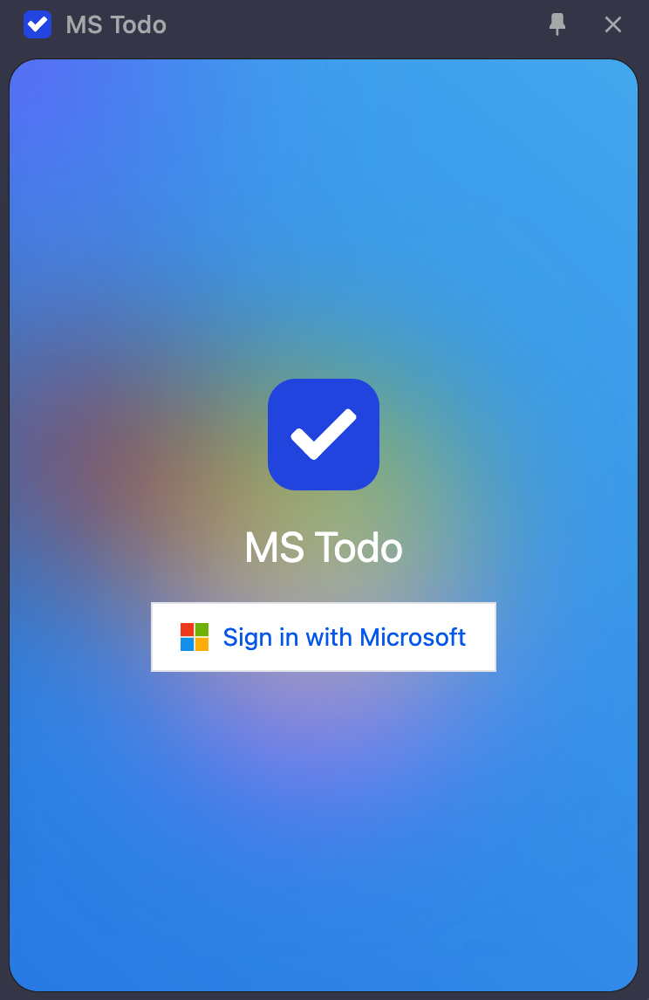
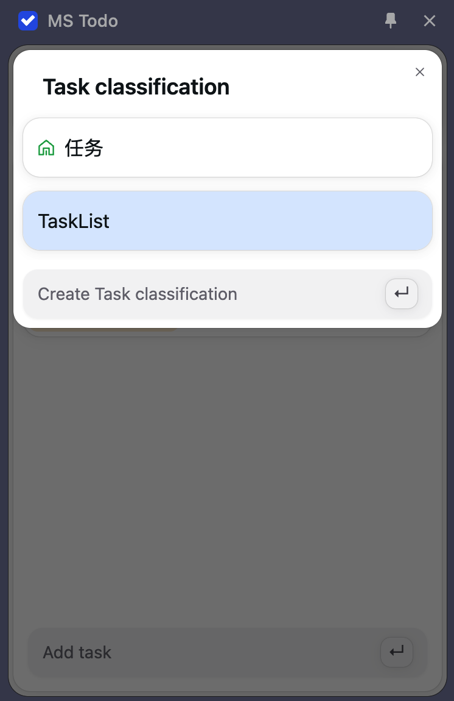
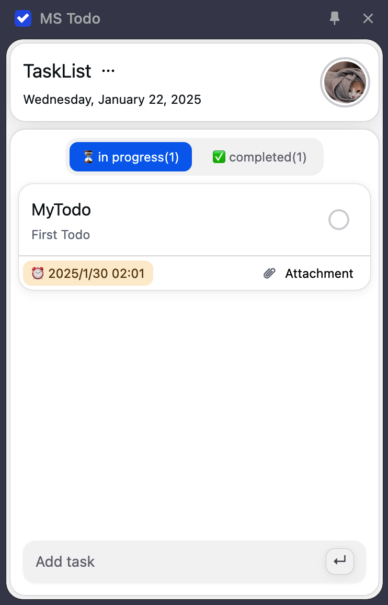
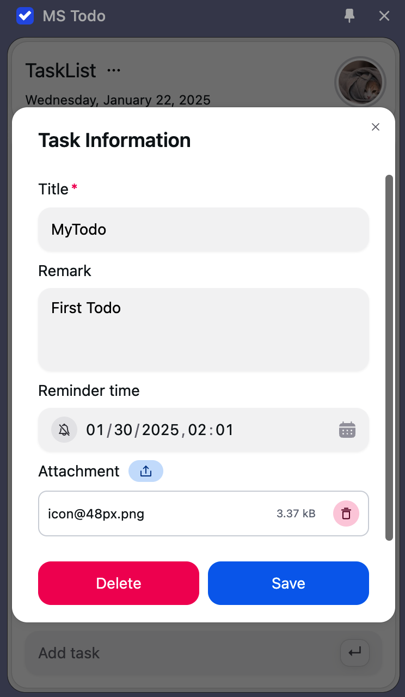

# Microsoft To do Chrome Extension

  

# Install

# 📢 Intro

## Highlights 🔥

<table>
 <tr>
  <th width="50%">
   
 Sync data by Microsoft account
   

  <th width="50%">
   
 Manage to do list category
   

 <tr>
  <th width="50%">
   
 Manage to do list
   

  <th width="50%">
   
 custom task detail and attachments
   

 <tr>
</table>

## Feedback

If you have any questions, please raise an issue.
